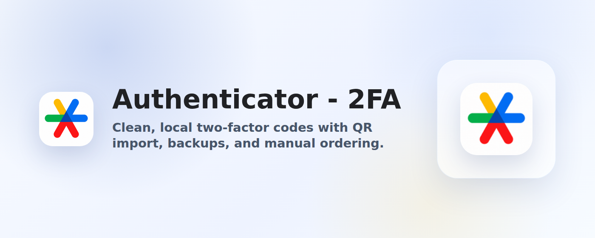

# Authenticator - 2FA

Browser extension for generating and managing two-factor authentication codes.

**Privacy:** Authenticator - 2FA strictly does not track users, collect analytics, or collect user data. Account secrets and codes stay stored locally on the user's device and are not sent to a remote service.



## Install

[](https://chromewebstore.google.com/detail/authenticator-2fa/pphhggggadbehnhklioamemafkeegfjf)
[](https://microsoftedge.microsoft.com/addons/detail/lngkiejjggjenmeelgcadhilloeffkdl)

## Features

- Generate TOTP, HOTP, and Steam-style 2FA codes.
- Add accounts from QR images, page QR scans, pasted otpauth text, or manual entry.
- Search, copy, and drag-reorder accounts.
- Import/export otpauth text and encrypted backups.
- Optional local vault password protection.
- Local-first storage with no account service.

**Important: Users are responsible for maintaining their own backups of 2FA codes and recovery methods. We are not responsible for lost, deleted, inaccessible, or unrecoverable 2FA codes.**

## Development

```sh
npm install
npm run dev
```

Useful commands:

```sh
npm run check
npm run test
npm run build
npm run package
```

`npm run package` builds extension zips for `chrome`, `edge`, and `firefox` into `artifacts/`.

## Store Assets

Project assets are grouped under `assets/` by lifecycle:

- `assets/brand/` source artwork for generated extension icons
- `assets/extension/` static files copied into extension packages
- `assets/store/` store icons, screenshots, and promo tiles kept outside the extension bundle

Regenerate screenshots and promo tiles with:

```sh
npm run store:screenshots
```

This command uses synthetic demo accounts and a local browser to render store-ready images.
Temporary store listing text drafts can live in `.tmp/store-listing/`, which is ignored by git.

## Releases

Pushing a tag like `v1.2.3` runs the release workflow. The workflow applies the tag version, builds all targets, packages the zips, creates the GitHub release, and uploads the browser extension assets.

## License

MIT
