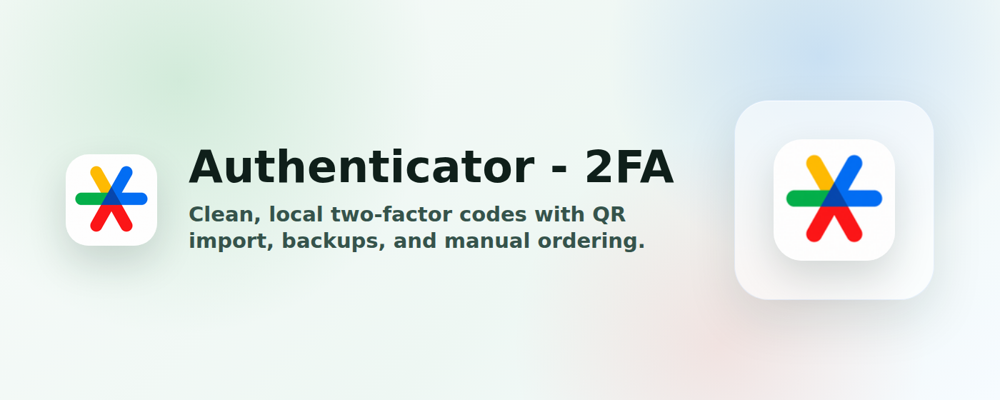

# Authenticator - 2FA

Browser extension for generating and managing two-factor authentication codes.



## Features

- Generate TOTP, HOTP, and Steam-style 2FA codes.
- Add accounts from QR images, page QR scans, pasted otpauth text, or manual entry.
- Search, copy, and drag-reorder accounts.
- Import/export otpauth text and encrypted backups.
- Optional local vault password protection.
- Local-first storage with no account service.

## Development

```sh
npm install
npm run dev
```

Useful commands:

```sh
npm run check
npm run test
npm run build
npm run package
```

`npm run package` builds extension zips for `chrome`, `edge`, and `firefox` into `artifacts/`.

## Store Assets

Store screenshots, promo tiles, and listing text are kept outside the extension bundle:

- `store-assets/`
- `store-listing/`

Regenerate screenshots and promo tiles with:

```sh
npm run store:screenshots
```

This command uses synthetic demo accounts and a local browser to render store-ready images.

## Releases

Pushing a tag like `v1.2.3` runs the release workflow. The workflow applies the tag version, builds all targets, packages the zips, creates the GitHub release, and uploads the browser extension assets.

## License

MIT
